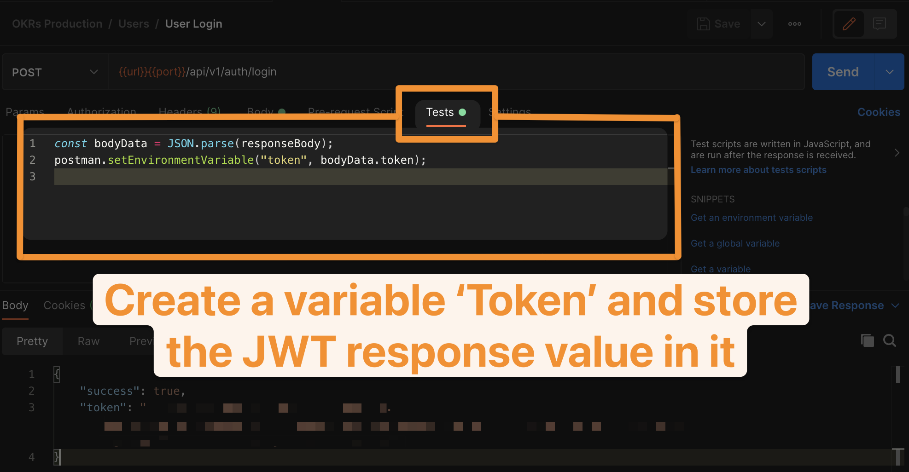

# Objectives and Key Results

OKRs are comprised of **Objectives** (*some desireable outcome you'd like to produce*) and **Key Results** (*measurable indicators to track success*). OKRs are used to define how to track goals with measurable actions that gage success. A 70% success rate is typically desirable

## Good OKRs

Typically, you want 3-5 **Objectives** to strive for over a fiscal quarter

Each **Objective** should have 3-5 **Key Results** that measure success in achieving the **Objective**

## Why this app?

OKR tracking software is cumbersome, overly complicated and requires a high LOE to set and track OKRs. It's also difficult to access browser software via a mobile device and vice versa

## Our goal in creating the app

Define an **Objective** and the time frame - typically a fiscal quarter. e.g. Q3 2021 (2021-07-01 - 2021-09-30)

Define some **Key Results** you can measure that indicate the success in achieving the **Objective**

Once the time frame begins, keep your **Key Results** up to date by simply updating the 'current value'

## Objective and key result % complete tracking

Current value / target value = key result % completed

The avg. of all key results % completed becomes the objective % completed

## Tech Stack

### Backend

- Node.JS
- MongoDb
- Mongoose

### Frontend

- React Native (*mobile*)
- React (*browser*)

### Objective Data Structure

``` json
  "atRisk": false,
  "percentComplete": 0,
  "_id": "6117e320fd7d720fa058935f",
  "name": "Take A Family Vacation",
  "description": "We need a Family Vacation, Preferably somewhere in Europe",
  "objectiveStartDate": "2021-07-01T00:00:00.000Z",
  "objectiveEndDate": "2021-09-30T00:00:00.000Z",
  "user": "60e2f4d5a85e1c5ba5fc999e",
  "slug": "take-a-family-vacation",
  "__v": 0
```

### Key Result Structure

Each **Key Result** belongs to an **Objective**

```json
        "atRisk": true,
        "progress": 50,
        "currentValue": 4000,
        "targetValue": 8000,
        "_id": "6117b8a43dafef88ed45c367",
        "name": "Save 8 Grand within the next 8 months",
        "description": "8 grand should allow us the funds needed for a all inclusive vacation",
        "objective": {
            "atRisk": false,
            "percentComplete": 50,
            "_id": "6117a57dcfe348f9d7865846",
            "name": "Take A Family Vacation",
            "description": "We need a Family Vacation, Preferably somewhere in Europe",
            "user": "60e2f4d5a85e1c5ba5fc995e",
            "slug": "brandon-go-on-a-vacation",
            "__v": 0,
            "id": "6117a57dcfe348f9d7865846"
        },
        "user": "60e2f4d5a85e1c5ba5fc995e",
        "tasks": [],
        "slug": "save-8-grand-within-the-next-8-months",
        "__v": 0,
        "id": "6117b8a43dafef88ed45c367"
````

## How to Install

Clone/Fork the repro

> npm install

create a .env file in config folder - **see exampleEnv for environment variables**

## How to run local dev

Once you've updated the .evn with your mongo db connection url, and ran 'npm install', run the below

> npm run dev

## API Documentation

> In the examples below, we're on localhost listening on port 2002 -> spinning up the server with npm run dev will output the port number or you can find it in the app.js file

### User Creation, Login and Authorization

``` js
curl --location -g --request POST '{{url}}{{port}}/api/v1/auth/registration' \
--data-raw '{
    "name": "what ever you want here!",
    "email": "yourEmail@YourEmail.com",
    "password": "superSecretPasswordOfYourChoosing!"
}'
```

All routes are password protected with JWT Tokening, in order to create, read, update, or delete resources, you need an **Auth Token**

``` js
curl --location -g --request POST '{{url}}{{port}}/api/v1/auth/login' \
--data-raw '{
    "email": "yourEmail@yourEmail.com",
    "password": "yourPassWordHere"
}'
```

> Example Response

``` json
{
    "success": true,
    "token": "JWT Token Here"
}
```

If you're using a http client like Postman, you can store the token response as a collection variable. In the example below, we're storing the JWT response value as 'token' and passing ``` Authorization: Bearer {{token}} ``` on all subsequent calls



## Objective Routes

### Post - Create an Objective

> api/v1/objectives

``` bash
curl --location --request POST 'http://localhost:2002/api/v1/objectives' \
--header 'Authorization: Bearer {{token}}' \
--data-raw '{
    "name": "Brandon - Take a Family Vacation",
    "description": "Lambert Family Vacation to Europe",
    "atRisk": false,
    "objectiveStartDate": "2021-07-01",
    "objectiveEndDate": "2021-09-30"
}'
```

### Get Objectives

> api/v1/objectives

``` bash
curl --location --request GET 'http://localhost:2002/api/v1/objectives' \
--header 'Authorization: Bearer {{token}}'
```

### Get Single Objective

> api/v1/objectives/{{objective_id}}

``` bash
curl --location --request GET 'http://localhost:2002/api/v1/objectives/{{resourceId}}' \
--header 'Authorization: Bearer {{token}}'
```

### Update Objective

> api/v1/objectives/{{objective_id}}

``` bash
curl --location --request PUT 'http://localhost:2002/api/v1/objectives/60ddd3bd80473e478168f479' \
--header 'Authorization: Bearer {{token}}' \
--data-raw '{
    "name": "Updated Objective Name Here!"
}'
```

### Delete Single Objective

> api/v1/objectives/{{objective_id}}

``` bash
curl --location --request DELETE 'http://localhost:2002/api/v1/objectives/{{resourceId}}' \
--header 'Authorization: Bearer {{token}}'
```

## Key Results

### Create a Single Key Result

Key Results *belong* to an objective, this is handled by having a nested route

>/api/v1/objectives/{{objective_id}}/keyresults

append '/keyresults' to the end of the single objective call and update the method to POST to create a key result for the objective

``` bash
curl --location -g --request POST '{{url}}{{port}}/api/v1/objectives/60ddd4d0599562570c8896e5/keyresults' \
--header 'Authorization: Bearer {{token}}' \
--data-raw '{
    "name": "Save Enough Money for Food, Air Travel, AirBNB and Attractions!",
    "description": "Save Enough Money for a Family Trip to a European Capital!",
    "currentValue": 4000,
    "targetValue": 8000,
    "atRisk": true
}'
```

#### Example Response

> in the response, the 'progress' field is dynamically created

``` json
{
    "success": true,
    "data": {
        "atRisk": true,
        "progress": 50,
        "currentValue": 4000,
        "targetValue": 8000,
        "_id": "6117c12d7fe0d3fd8c7c6307",
        "name": "Save Enough Money for Food, Air Travel, AirBNB and Attractions!",
        "description": "Save Enough Money for a Family Trip to a European Capital!",
        "objective": "6117c0d27fe0d3fd8c7c62eb",
        "user": "60e2f4d5a85e1c8ba5hx456b",
        "tasks": [],
        "slug": "save-enough-money-to-go-to-europe!-3",
        "__v": 0
    }
}
```

### Get Key Results for Objective

> /api/v1/objectives/{{objective_id}}/keyresults

``` bash
curl --location -g --request GET '{{url}}{{port}}/api/v1/objectives/60ddd3bd80473e478168f479/keyresults' \
--header 'Authorization: Bearer {{token}}'
```

#### Key Result Example Response

Objective data is virtualized and included in the JSON response - see Mongoose Virtuals for more info

``` json
{
    "success": true,
    "count": 2,
    "pagination": {},
    "data": [
        {
            "atRisk": true,
            "progress": 25,
            "currentValue": 2000,
            "targetValue": 8000,
            "_id": "6117c0e07fe0d3fd8c7c62ef",
            "name": "Save Enough Money for Food, Air Travel, AirBNB and Attractions!",
            "description": "Save Enough Money for a Family Trip to a European Capital!",
            "objective": {
                "_id": "6117c0d27fe0d3fd8c7c62eb",
                "name": "Brandon - Go On a Vacation",
                "description": "We need a Family Vacation:",
                "id": "6117c0d27fe0d3fd8c7c62eb"
            },
            "user": "60e2f4d5a85e1c5ba5fc995e",
            "tasks": [],
            "slug": "save-enough-money-to-go-to-europe!",
            "__v": 0
        }
    ]
}
```

### Get All Key Results

> api/v1/keyresults

``` bash
curl --location -g --request GET '{{url}}{{port}}/api/v1/keyresults' \
--header 'Authorization: Bearer {{token}}'
```

### Get a Single Key Result

> api/v1/keyresults/{{keyResults_id}}

``` bash
curl --location -g --request GET '{{url}}{{port}}/api/v1/keyresults/{{keyResult_id}}' \
--header 'Authorization: Bearer {{token}}'
```

### Update Key Result

> api/v1/keyresults/{{keyResult_Id}}

``` Bash
curl --location -g --request PUT '{{url}}{{port}}/api/v1/keyresults/60e2fb661395cec29980f3f5' \
--header 'Authorization: Bearer {{token}}' \
--data-raw '{
    "name": "Updated Key Result Name"
}'
```

### Delete Key Result

> api/v1/keyresults/{{keyResult_Id}}

``` Bash
curl --location -g --request Delete '{{url}}{{port}}/api/v1/keyresults/{{KeyResult_id}}' \
--header 'Authorization: Bearer {{token}}' \
--data-raw '{
    "name": "Updated Key Result Name"
}'
```

----

### Mongo Query Options

On the '*select all*' calls, you can pass logical operators for filtering down the results

Working off of API Master Class course (udemy.com - Brad Traversy), we're using the same type of Advanced Filtering options.

> api/v1/objectives?select=description,name,atRisk

``` bash
curl --location --request GET 'http://localhost:2002/api/v1/objectives?select=description,name,atRisk' \
--header 'Authorization: Bearer {{token}}'
```

- select
  
- sort

- page

- limit

Mongo operators

[lt] -  less than
[lte] - less than or equal to
[gt] -  greater than
[gte] - greater than or equal to
[in] -  in
